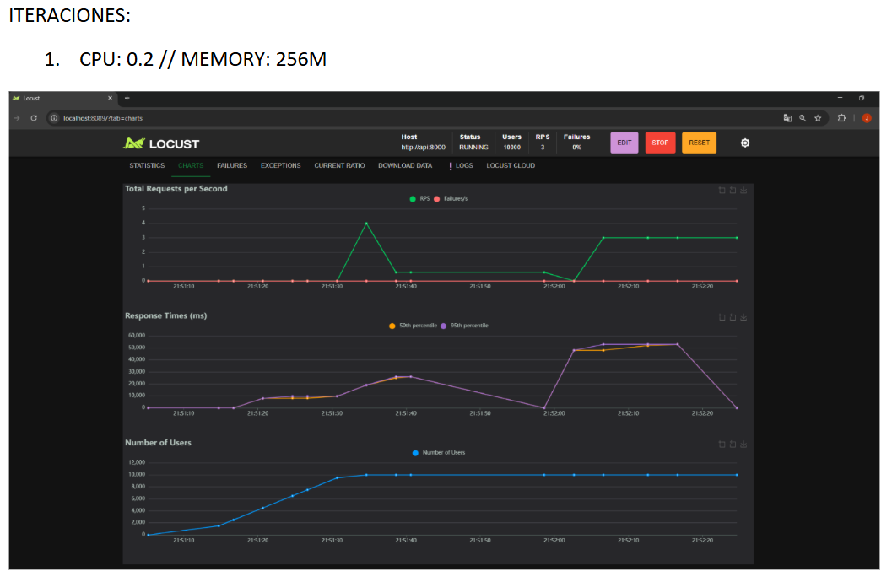
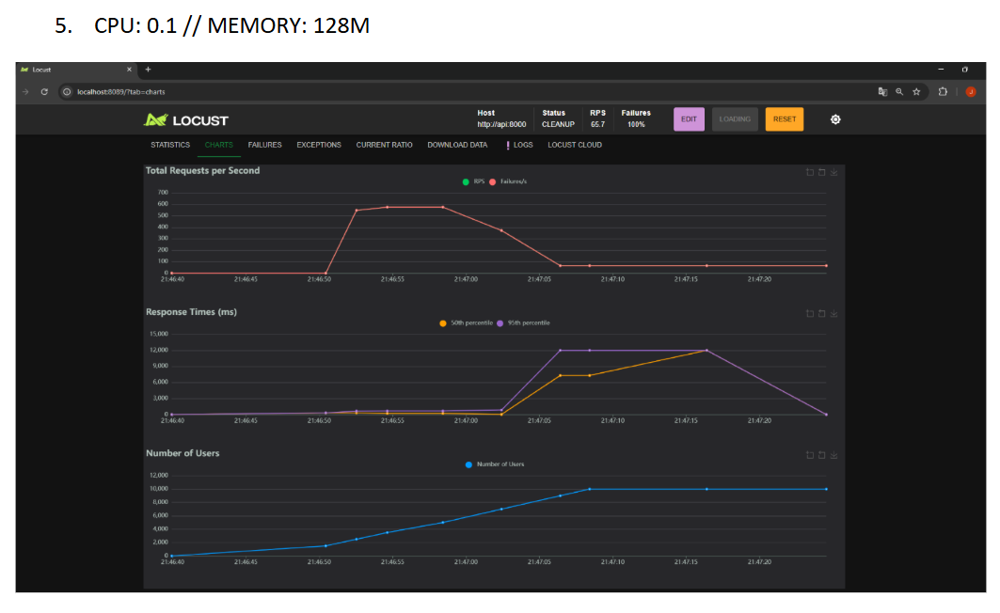
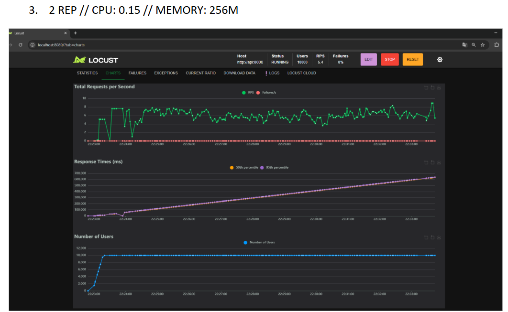
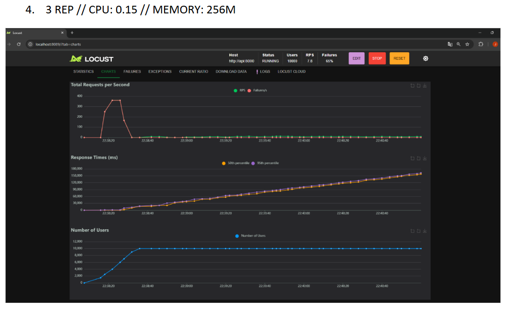

# Taller Locust: MLOps - Despliegue y Monitoreo (Grupo 5 - Clase de los Martes)

## Descripción

Este proyecto configura un entorno de pruebas de carga utilizando **Locust**, junto con un servicio backend que expone modelos de Machine Learning a través de una API construida en **FastAPI**. El entorno se orquesta usando **Docker Compose**, permitiendo simular usuarios concurrentes para evaluar el rendimiento del sistema de inferencia.

## Estructura del Proyecto

```
./locust
├── data                  # Datos de entrada para entrenamiento/pruebas
│   ├── penguins_lter.csv
│   └── penguins_size.csv
├── models                # Modelos de machine learning entrenados (pkl)
│   ├── model_lr.pkl
│   ├── model_rf.pkl
│   └── model_svm.pkl
├── locustfile.py         # Script principal para pruebas de carga con Locust
├── main.py               # API con FastAPI para exponer modelos
├── Dockerfile            # Imagen base para la API
├── Dockerfile.locust     # Imagen base para los tests con Locust
├── requirements.txt      # Requisitos para la API
├── requirements-locust.txt # Requisitos para Locust
├── docker-compose.yaml   # Orquestación de API y dependencias
└── docker-compose.locust.yaml # Orquestación para pruebas con Locust
```

## Servicios Implementados

- **FastAPI**: Servicio backend con endpoints para inferencia de modelos de clasificación.
- **Locust**: Framework para pruebas de carga y simulación de usuarios concurrentes.

## Pasos para la Ejecución

### 1. Clonar el repositorio

```bash
git clone <URL_DEL_REPOSITORIO>
cd locust
```

### 2. Construir y levantar la API

```bash
docker-compose -f docker-compose.yaml up -d --build
```

### 3. Acceder a la documentación de la API

- URL: [http://localhost:8000/docs](http://localhost:8000/docs)

### 4. Ejecutar Locust para pruebas de carga

```bash
docker-compose -f docker-compose.locust.yaml up -d --build
```

- Acceder a la interfaz de Locust:
  - URL: [http://localhost:8089](http://localhost:8089)

- Parámetros sugeridos:
  - Número de usuarios: 10000
  - Agregación de usuarios: 500
  - Endpoint a probar: `/predict` con el siguiente body:

```json
{
  "island": "Biscoe",
  "culmen_length_mm": 50.0,
  "culmen_depth_mm": 18.5,
  "flipper_length_mm": 200.0,
  "body_mass_g": 4000.0,
  "sex": "MALE"
}
```


### 5. Resultados y Conclusiones de las Pruebas

En cada prueba, utilizamos 10 000 usuarios concurrentes con un ramp-up de 500 usuarios/seg. El objetivo fue encontrar la configuración mínima de CPU/RAM capaz de soportar dicha carga y luego probar la **escalabilidad horizontal** incrementando el número de réplicas.

A continuación, se muestran 4 capturas relevantes (ubicadas en la carpeta `imagenes/`), junto con el análisis de cada escenario:

---

#### 5.1 Escenario: 1 réplica, CPU=0.2, 256MB RAM



- **Observaciones**:  
  - El Throughput (línea verde, RPS) apenas oscila entre 1-4 peticiones/seg.  
  - **0 % fallos**: no hay errores, pero la latencia (p95) se eleva a varios segundos.  
  - Con recursos tan limitados, la API no se “rompe” pero responde **muy lentamente**.  
- **Conclusión**: Aun sin errores, el tiempo de respuesta es demasiado alto para un escenario de 10 000 usuarios, evidenciando un cuello de botella en la CPU asignada.

---

#### 5.2 Escenario: 1 réplica, CPU=0.1, 128MB RAM



- **Observaciones**:  
  - Inicialmente se ve un pico de ~500 RPS, pero colapsa rápidamente a 0.  
  - **100 % fallos**: todas las solicitudes terminan en error tras el pico inicial.  
  - El contenedor se queda sin recursos de CPU/memoria para sostener la carga.  
- **Conclusión**: Con solo 0.1 CPU y 128MB de RAM, el servicio no puede mantenerse operativo ante 10 000 usuarios concurrentes, arrojando un fallo total (100 % de errores).

---

#### 5.3 Escenario: 2 réplicas, CPU=0.15, 256MB RAM



- **Observaciones**:  
  - El RPS (línea verde) queda muy bajo (4-8 peticiones/seg) y la latencia p95 crece a decenas de segundos.  
  - **0 % fallos**: la API responde a todas las solicitudes, pero de manera **extremadamente lenta** para muchos usuarios.  
  - Escalar de 1 a 2 réplicas ayuda a evitar errores, pero la velocidad de respuesta sigue siendo muy mala.  
- **Conclusión**: Con CPU=0.15 y 256MB por contenedor, dos réplicas no colapsan, pero la latencia es demasiado elevada para ser aceptable en producción.

---

#### 5.4 Escenario: 3 réplicas, CPU=0.15, 256MB RAM



- **Observaciones**:  
  - Se ve un pico inicial más alto (~300 RPS), pero alrededor del **66 %** de las solicitudes fallan a medida que avanza la prueba.  
  - El 34 % restante logra completarse, aunque con latencias p95 muy elevadas (varios segundos).  
  - Añadir más réplicas incrementa momentáneamente el throughput, pero no resuelve el cuello de botella de CPU por contenedor.  
- **Conclusión**: La escalabilidad horizontal eleva el rendimiento inicial, pero muchos requests terminan en error si se mantiene la misma asignación de CPU/memoria mínima (0.15 CPU, 256MB).

---

### 6. Conclusiones Generales

1. **La CPU es el principal limitante**: Asignaciones por debajo de ~0.2 CPU provocan altas latencias o fallos masivos.  
2. **Latencia vs. Fallos**:  
   - Con pocas réplicas y CPU baja, a veces se obtienen 0 % de errores pero con latencias inaceptables (decenas de segundos).  
   - Con más réplicas, el throughput inicial aumenta pero surgen bastantes errores cuando la carga se estabiliza en 10 000 usuarios.  
3. **Escalabilidad Vertical y Horizontal**:  
   - Aumentar CPU y RAM por contenedor reduce drásticamente la latencia y la tasa de fallos.  
   - Escalar horizontalmente sin subir los recursos mínimos por contenedor puede mejorar momentáneamente, pero no soluciona la saturación en altos niveles de concurrencia.  
4. **Recomendación**:  
   - Encontrar un equilibrio de recursos (por ejemplo, 0.5 CPU y 512MB RAM por contenedor) y luego escalar horizontalmente según la demanda.  
   - Monitorizar en producción (Prometheus, Grafana) para ajustar dinámicamente las réplicas ante picos de tráfico.


## Comandos Útiles

- Parar los contenedores sin eliminar:
  ```bash
  docker-compose -f docker-compose.yaml stop
  docker-compose -f docker-compose.locust.yaml stop
  ```

- Reiniciar los contenedores:
  ```bash
  docker-compose restart
  ```

- Eliminar contenedores y volúmenes:
  ```bash
  docker-compose down -v
  docker-compose -f docker-compose.locust.yaml down -v
  ```

## Autores

Desarrollado por Grupo 5.
